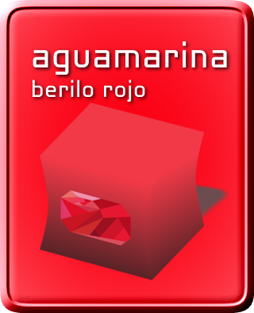

# Berilo Rojo

## Repository generator for Aguamarina

### Running on Linux
Prior to running brextras.php and berilorojo.php, configure them using your favorite text editor.
You will need the following:
- PHP (Preferably 8.2, but past versions should do fine)
- PHP DOM extension
- AAPT for Android 1.6 (Included in Releases)
- x86 program support (for aapt)

### Description metadata
Descriptions are contained within ```<cmt>``` tags and can be easily edited.
### Category metadata
To add categories to an application, edit the generated extras.xml and change the tag text inside ```<catg>``` into one of the following categories:
- ```Games```
- ```Applications```
- ```Others```
\Once you have set the main category (```<catg>```) you can set the ```<catg2>``` tag text to one of the following, depending on the main category
#### Games
> Arcade & Action, Brain & Puzzle, Cards & Casino, Casual, Emulators, Other
#### Applications
> Comics, Communication, Entertainment, Finance, Health, Lifestyle, Multimedia, News & Weather, Productivity, Reference, Shopping, Social, Sports, Themes, Tools, Travel, Demo, Software Libraries, Other

Afterwards, regenerate the info.xml file to add the categories and you're all set.
